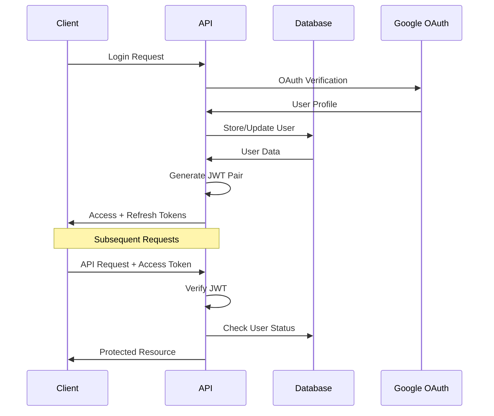
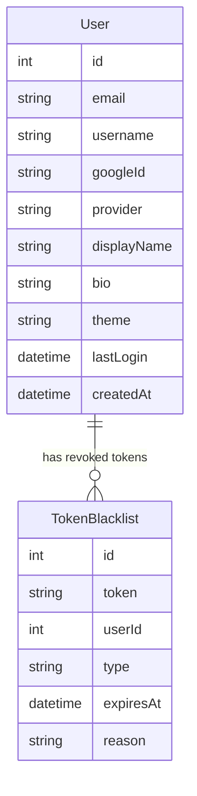

# Game Backlog Tracker - Comprehensive Project Guide
*Security, Architecture, Testing, and Code Implementation Overview*

---

## 📖 Table of Contents

1. [Project Overview](#project-overview)
2. [System Architecture](#system-architecture)
3. [Security Implementation](#security-implementation)
4. [Authentication System](#authentication-system)
5. [Database Design](#database-design)
6. [Testing Strategy](#testing-strategy)
7. [Code Structure & Key Components](#code-structure--key-components)
8. [API Design](#api-design)
9. [Performance & Scalability](#performance--scalability)
10. [Development Workflow](#development-workflow)
11. [Deployment & Monitoring](#deployment--monitoring)
12. [Future Roadmap](#future-roadmap)

---

## 1. Project Overview

### 🎯 Mission
Build a modern, secure web application for managing video game backlogs with comprehensive user authentication, profile management, and game tracking capabilities.

### 🚀 Tech Stack Summary

**Frontend:**
- React 19.1.1 with Vite
- Tailwind CSS for responsive design
- React Router DOM for navigation
- Axios for API communication
- React Hook Form for form management

**Backend:**
- Node.js with Express 5.1.0
- Prisma ORM with SQLite (development)
- JWT-based authentication
- Google OAuth 2.0 integration
- Comprehensive security middleware

**Development Tools:**
- Jest for testing (30.1.3)
- ESLint + Prettier for code quality
- Cross-platform compatibility
- Hot-reload development environment

### 🎮 Core Features
- User registration and authentication
- Google OAuth integration
- Profile management with avatars
- Game backlog tracking
- Progress monitoring
- Secure API endpoints
- Mobile-responsive design

---

## 2. System Architecture

### 🏗️ Architectural Pattern
**Model-View-Controller (MVC) with Service Layer**

```
┌─────────────────┐    ┌─────────────────┐    ┌─────────────────┐
│   React Client  │    │  Express API    │    │   Database      │
│   (Frontend)    │◄──►│   (Backend)     │◄──►│   (SQLite)      │
└─────────────────┘    └─────────────────┘    └─────────────────┘
       │                        │                        │
       │                        │                        │
   ┌───▼───┐              ┌─────▼─────┐            ┌─────▼─────┐
   │ Views │              │Controllers│            │  Models   │
   │Routes │              │Middleware │            │  Schema   │
   │State  │              │Services   │            │  Queries  │
   └───────┘              └───────────┘            └───────────┘
```

### 📦 Layer Responsibilities

**Frontend Layer (React)**
- User interface rendering
- State management (Context API)
- Form validation and submission
- API communication
- Route protection

**API Layer (Express)**
- Request/response handling
- Authentication middleware
- Input validation
- Business logic coordination
- Error handling

**Service Layer**
- JWT token management
- External API integrations
- Email services
- File upload handling

**Data Layer (Prisma + SQLite)**
- Database schema management
- Query optimization
- Data validation
- Migration handling

### 🔗 Communication Flow

1. **Client Request** → Frontend validates input
2. **API Call** → Axios sends authenticated request
3. **Middleware** → JWT validation & rate limiting
4. **Controller** → Business logic processing
5. **Service** → Database operations via Prisma
6. **Response** → JSON data back to client
7. **UI Update** → React re-renders with new state

---

## 3. Security Implementation

### 🛡️ Security Layers

#### Authentication Security
```javascript
// JWT Token Structure
{
  "userId": 1,
  "email": "user@example.com", 
  "username": "username",
  "type": "access", // or "refresh"
  "iss": "game-backlog-tracker",
  "aud": "game-backlog-tracker-client",
  "exp": 1640995200
}
```

**Security Features:**
- HMAC-SHA256 token signing
- Short-lived access tokens (15 minutes)
- Refresh token rotation
- Token blacklisting for revocation
- Brute force protection

#### Request Security
```javascript
// Middleware Stack
app.use(helmet()); // Security headers
app.use(rateLimit({
  windowMs: 15 * 60 * 1000, // 15 minutes
  max: 100 // limit each IP to 100 requests per windowMs
}));
app.use(cors({
  origin: process.env.FRONTEND_URL,
  credentials: true
}));
```

#### Data Security
- SQL injection prevention (Prisma ORM)
- XSS protection (input sanitization)
- CSRF protection (SameSite cookies)
- Secure password handling (bcrypt)
- Environment variable protection

### 🔐 Authentication Flow



### 🚨 Security Monitoring

**Token Blacklist System:**
```javascript
// Revoked tokens are stored and checked
const isBlacklisted = await isTokenBlacklisted(token);
if (isBlacklisted) {
  return res.status(401).json({
    error: 'TOKEN_REVOKED',
    message: 'Access token has been revoked'
  });
}
```

**Failed Login Protection:**
- Account lockout after 5 failed attempts
- Exponential backoff timing
- Audit logging for security events

---

## 4. Authentication System

### 🔑 JWT Implementation

#### Token Generation
```javascript
const generateAccessToken = (user) => {
  const payload = {
    userId: user.id,
    email: user.email,
    username: user.username,
    type: 'access',
  };

  return jwt.sign(payload, process.env.JWT_SECRET, {
    expiresIn: '15m',
    issuer: 'game-backlog-tracker',
    audience: 'game-backlog-tracker-client',
  });
};
```

#### Token Verification
```javascript
const verifyToken = (token) => {
  try {
    return jwt.verify(token, process.env.JWT_SECRET, {
      issuer: 'game-backlog-tracker',
      audience: 'game-backlog-tracker-client',
    });
  } catch (error) {
    throw new Error(`Token verification failed: ${error.message}`);
  }
};
```

### 🔒 Middleware Protection

```javascript
const requireAuth = async (req, res, next) => {
  try {
    const authHeader = req.headers.authorization;
    const token = extractTokenFromHeader(authHeader);
    
    // Check blacklist
    const isBlacklisted = await isTokenBlacklisted(token);
    if (isBlacklisted) {
      return res.status(401).json({
        error: 'TOKEN_REVOKED',
        message: 'Access token has been revoked'
      });
    }
    
    // Verify token
    const decoded = verifyToken(token);
    if (decoded.type !== 'access') {
      return res.status(401).json({
        error: 'INVALID_TOKEN_TYPE',
        message: 'Access token required'
      });
    }
    
    // Fetch fresh user data
    const user = await prisma.user.findUnique({
      where: { id: decoded.userId }
    });
    
    if (!user) {
      return res.status(401).json({
        error: 'USER_NOT_FOUND',
        message: 'User account no longer exists'
      });
    }
    
    req.user = user;
    next();
  } catch (error) {
    return res.status(401).json({
      error: 'INVALID_TOKEN',
      message: 'Invalid or expired access token'
    });
  }
};
```

### 🌐 Google OAuth Integration

**OAuth Flow:**
1. Client redirects to Google
2. User authorizes application
3. Google returns authorization code
4. Backend exchanges code for profile
5. User created/updated in database
6. JWT tokens generated and returned

---

## 5. Database Design

### 📊 Schema Architecture

#### User Model
```sql
model User {
  id           Int      @id @default(autoincrement())
  email        String   @unique
  username     String   @unique
  firstName    String?
  lastName     String?
  
  -- OAuth Integration
  googleId     String?  @unique
  profilePicture String?
  provider     String   @default("google")
  
  -- Profile Management
  displayName  String?
  bio          String?
  avatarUrl    String?
  theme        String   @default("dark")
  preferences  String?  -- JSON for user preferences
  
  -- Security Tracking
  lastLogin    DateTime?
  refreshToken String?
  failedLoginAttempts Int @default(0)
  lockedUntil  DateTime?
  
  -- Timestamps
  createdAt    DateTime @default(now())
  updatedAt    DateTime @updatedAt
}
```

#### Token Blacklist Model
```sql
model TokenBlacklist {
  id        Int      @id @default(autoincrement())
  token     String   @unique
  userId    Int?
  type      String   -- 'access' or 'refresh'
  expiresAt DateTime
  reason    String?  -- Reason for blacklisting
  createdAt DateTime @default(now())
}
```

### 🔄 Database Relationships



### 📈 Database Operations

**Query Optimization:**
- Indexed unique fields (email, username, googleId)
- Efficient token lookups
- Prisma query optimization
- Connection pooling

**Migration Strategy:**
- Version-controlled schema changes
- Backwards compatibility
- Data migration scripts
- Rollback procedures

---

## 6. Testing Strategy

### 🧪 Testing Architecture

#### Testing Pyramid
```
                    ┌─────────────┐
                   │   E2E Tests   │ ← Cypress (Planned)
                  └─────────────┘
                ┌─────────────────┐
               │ Integration Tests │ ← Supertest + Jest
              └─────────────────┘
            ┌─────────────────────┐
           │     Unit Tests        │ ← Jest + Mocking
          └─────────────────────┘
```

#### Current Testing Status
| Component | Coverage | Status | Tests |
|-----------|----------|---------|-------|
| **JWT Utilities** | 100% | ✅ Complete | 44 unit tests |
| **Auth Middleware** | 36% | 🔄 In Progress | 16 unit tests |
| **Profile Routes** | 78% | 🔄 In Progress | API integration tests |
| **Overall Backend** | 25% | 🔄 In Progress | 135 total tests |

**Target**: 90% coverage across all components

### ✅ Unit Testing Implementation

#### JWT Utilities Testing
```javascript
describe('JWT Utilities', () => {
  test('should generate valid access token', () => {
    const token = generateAccessToken(mockUser);
    
    expect(token).toBeDefined();
    expect(typeof token).toBe('string');
    expect(token.split('.')).toHaveLength(3); // JWT structure
  });
  
  test('should validate token payload integrity', () => {
    const token = generateAccessToken(mockUser);
    const decoded = verifyToken(token);
    
    expect(decoded.userId).toBe(mockUser.id);
    expect(decoded.type).toBe('access');
    expect(decoded.aud).toBe('game-backlog-tracker-client');
  });
  
  test('should handle token expiration', () => {
    // Test with expired token
    expect(() => verifyToken(expiredToken)).toThrow();
  });
});
```

#### Authentication Middleware Testing
```javascript
describe('Authentication Middleware', () => {
  test('should authenticate valid JWT token', async () => {
    const token = generateAccessToken(mockUser);
    req.headers.authorization = `Bearer ${token}`;

    await requireAuth(req, res, next);

    expect(req.user).toBeDefined();
    expect(req.user.id).toBe(mockUser.id);
    expect(next).toHaveBeenCalled();
  });
  
  test('should reject blacklisted token', async () => {
    mockIsTokenBlacklisted.mockResolvedValue(true);
    
    await requireAuth(req, res, next);

    expect(res.status).toHaveBeenCalledWith(401);
    expect(res.json).toHaveBeenCalledWith({
      error: 'TOKEN_REVOKED',
      message: 'Access token has been revoked'
    });
  });
});
```

### 🔧 Testing Configuration

#### Jest Setup
```json
{
  "testEnvironment": "node",
  "globals": { "NODE_ENV": "test" },
  "coverageThreshold": {
    "global": {
      "branches": 90,
      "functions": 90,
      "lines": 90,
      "statements": 90
    }
  },
  "collectCoverageFrom": [
    "**/*.js",
    "!**/node_modules/**",
    "!**/coverage/**"
  ]
}
```

#### Cross-Platform Support
```json
{
  "scripts": {
    "test:unit": "cross-env NODE_ENV=test NODE_OPTIONS='--experimental-vm-modules' jest --testPathPatterns=unit",
    "test:integration": "cross-env NODE_ENV=test NODE_OPTIONS='--experimental-vm-modules' jest --testPathPatterns=integration",
    "test:coverage": "cross-env NODE_ENV=test NODE_OPTIONS='--experimental-vm-modules' jest --coverage"
  }
}
```

### 📊 Testing Results

**Latest Test Run:**
```
Test Suites: 2 passed, 2 total
Tests:       44 passed, 44 total
Snapshots:   0 total
Time:        0.601 s
Coverage:    JWT utilities 100%, Auth middleware 36%
```

---

## 7. Code Structure & Key Components

### 📁 Project Structure

```
game-backlog-tracker/
├── frontend/
│   ├── src/
│   │   ├── components/     # React components
│   │   ├── contexts/       # Context providers
│   │   ├── hooks/          # Custom hooks
│   │   ├── services/       # API services
│   │   └── utils/          # Utility functions
│   ├── public/             # Static assets
│   └── package.json
├── backend/
│   ├── controllers/        # Route controllers
│   ├── middleware/         # Express middleware
│   ├── routes/            # API route definitions
│   ├── services/          # Business logic
│   ├── utils/             # Utility functions
│   ├── tests/             # Test suites
│   │   ├── unit/          # Unit tests
│   │   └── integration/   # Integration tests
│   ├── prisma/            # Database schema
│   └── server.js          # Application entry
└── docs/                  # Documentation
```

### 🔑 Key Components

#### JWT Utilities (`utils/jwt.js`)
```javascript
export {
  generateAccessToken,    // Creates 15-minute access tokens
  generateRefreshToken,   // Creates 7-day refresh tokens  
  verifyToken,           // Validates token integrity
  extractTokenFromHeader, // Parses Authorization header
  generateTokenPair,     // Creates token pair for login
};
```

**Key Features:**
- HMAC-SHA256 signing algorithm
- Configurable expiration times
- Proper audience/issuer validation
- Comprehensive error handling
- Type differentiation (access vs refresh)

#### Authentication Middleware (`middleware/auth.js`)
```javascript
export {
  requireAuth,        // Enforces authentication
  checkAuth,         // Optional authentication check
  requireRefreshToken, // Refresh token validation
};
```

**Security Features:**
- Token blacklist integration
- Fresh user data fetching
- Database error handling
- Production-safe error responses
- Request object user attachment

#### Profile API (`routes/profile.js`)
- User profile CRUD operations
- Avatar upload handling
- Preference management
- Input validation with Joi
- Authenticated route protection

### 🎨 Frontend Components

#### Authentication Context
```javascript
const AuthContext = createContext();

export const AuthProvider = ({ children }) => {
  const [user, setUser] = useState(null);
  const [loading, setLoading] = useState(true);
  
  // Token management
  // User state management
  // Protected route logic
};
```

#### Protected Routes
```javascript
const ProtectedRoute = ({ children }) => {
  const { user, loading } = useAuth();
  
  if (loading) return <LoadingSpinner />;
  if (!user) return <Navigate to="/login" />;
  
  return children;
};
```

---

## 8. API Design

### 🔗 RESTful Endpoints

#### Authentication Endpoints
```
POST   /api/auth/login           # User login
POST   /api/auth/register        # User registration  
POST   /api/auth/refresh         # Token refresh
POST   /api/auth/logout          # User logout
GET    /api/auth/google          # Google OAuth initiation
GET    /api/auth/google/callback # Google OAuth callback
```

#### Profile Endpoints
```
GET    /api/profile              # Get user profile
PUT    /api/profile              # Update user profile
POST   /api/profile/avatar       # Upload profile picture
DELETE /api/profile/avatar       # Remove profile picture
```

#### Health Check
```
GET    /health                   # Application health status
```

### 📝 Request/Response Patterns

#### Authentication Response
```json
{
  "user": {
    "id": 1,
    "email": "user@example.com",
    "username": "username",
    "firstName": "John",
    "lastName": "Doe"
  },
  "tokens": {
    "accessToken": "eyJhbGciOiJIUzI1NiIsInR5cCI6IkpXVCJ9...",
    "refreshToken": "eyJhbGciOiJIUzI1NiIsInR5cCI6IkpXVCJ9...",
    "tokenType": "Bearer",
    "expiresIn": 900
  }
}
```

#### Error Response
```json
{
  "error": "INVALID_TOKEN",
  "message": "Invalid or expired access token",
  "status": 401,
  "timestamp": "2023-12-01T12:00:00Z"
}
```

### 🛡️ API Security

**Rate Limiting:**
```javascript
const rateLimit = require('express-rate-limit');

const authRateLimit = rateLimit({
  windowMs: 15 * 60 * 1000, // 15 minutes
  max: 5, // 5 attempts per window
  message: 'Too many authentication attempts'
});
```

**Input Validation:**
```javascript
const loginSchema = Joi.object({
  email: Joi.string().email().required(),
  password: Joi.string().min(8).required()
});
```

---

## 9. Performance & Scalability

### ⚡ Performance Optimizations

#### Database Optimization
- Indexed frequently queried fields
- Efficient query patterns with Prisma
- Connection pooling
- Query result caching (planned)

#### JWT Performance
- Stateless token validation
- Minimal payload size
- Efficient token extraction
- In-memory blacklist caching (planned)

#### API Performance
- Response compression
- HTTP caching headers
- Parallel database queries
- Optimized JSON responses

### 📈 Scalability Considerations

#### Horizontal Scaling
- Stateless authentication design
- Database connection pooling
- Load balancer compatibility
- Session-free architecture

#### Monitoring & Metrics
```javascript
// Performance monitoring middleware
app.use((req, res, next) => {
  const start = Date.now();
  res.on('finish', () => {
    const duration = Date.now() - start;
    console.log(`${req.method} ${req.path} - ${duration}ms`);
  });
  next();
});
```

---

## 10. Development Workflow

### 🔄 Development Process

#### Git Workflow
1. Feature branches from main
2. Comprehensive testing
3. Code review process
4. Automated CI/CD pipeline

#### Code Quality
```json
{
  "scripts": {
    "lint": "eslint .",
    "lint:fix": "eslint . --fix",
    "format": "prettier --write \"**/*.{js,json}\"",
    "format:check": "prettier --check \"**/*.{js,json}\""
  }
}
```

#### Testing Workflow
1. Write failing tests (TDD)
2. Implement minimum functionality
3. Refactor with test safety net
4. Maintain 90% coverage requirement

### 📦 Build & Deployment

#### Development Setup
```bash
# Install dependencies
npm install

# Set up environment variables
cp .env.example .env

# Run database migrations
npm run db:migrate

# Start development servers
npm run dev
```

#### Production Build
```bash
# Backend production
npm run build
npm start

# Frontend production  
npm run build
npm run preview
```

---

## 11. Deployment & Monitoring

### 🚀 Deployment Strategy

#### Environment Configuration
- Separate dev/staging/production environments
- Environment-specific database configurations
- Secure secret management
- Health check endpoints

#### Database Management
- Automated migration deployment
- Backup and recovery procedures
- Performance monitoring
- Connection pool optimization

### 📊 Monitoring & Observability

#### Application Metrics
- Authentication success/failure rates
- API response times
- Error rate monitoring
- User activity tracking

#### Security Monitoring
- Failed login attempt detection
- Token blacklist activity
- Suspicious access pattern alerts
- Security audit logging

#### Health Checks
```javascript
app.get('/health', (req, res) => {
  res.json({
    status: 'OK',
    timestamp: new Date().toISOString(),
    uptime: process.uptime(),
    database: 'connected' // Check database connectivity
  });
});
```

---

## 12. Future Roadmap

### 🎯 Phase 2 Implementation

#### Frontend Testing
- React Testing Library integration
- Component unit testing  
- User interaction testing
- Accessibility testing

#### End-to-End Testing
- Cypress test automation
- Complete user journey testing
- Cross-browser compatibility
- Mobile responsiveness testing

#### Performance Testing
- Load testing with Artillery
- Authentication endpoint benchmarking
- Database performance optimization
- CDN integration for static assets

### 🔮 Future Features

#### Advanced Security
- Multi-factor authentication (MFA)
- OAuth provider expansion (GitHub, Discord)
- Advanced rate limiting with Redis
- Security audit trail

#### Enhanced Functionality  
- Game recommendation engine
- Social features and friend lists
- Advanced search and filtering
- Mobile application development

#### DevOps & Infrastructure
- Containerization with Docker
- Kubernetes deployment
- CI/CD pipeline enhancement
- Monitoring and alerting setup

---

## 📈 Success Metrics

### Quality Assurance
- **Code Coverage**: Target 90% (Currently 25%)
- **Test Execution**: <1 second unit test suite
- **Security Tests**: 100% authentication flow coverage
- **Performance**: <200ms API response times

### Security Benchmarks
- Zero authentication vulnerabilities
- 100% token validation coverage
- Complete error handling implementation
- Production-ready security headers

### Development Efficiency
- Automated testing pipeline
- Code quality gates enforced
- Documentation completeness
- Developer experience optimization

---

## 🎓 Key Learnings & Best Practices

### Architecture Decisions
1. **JWT over Sessions**: Stateless design for scalability
2. **Prisma ORM**: Type-safe database operations
3. **Middleware Pattern**: Separation of concerns
4. **Context API**: Centralized state management

### Security Implementation
1. **Defense in Depth**: Multiple security layers
2. **Principle of Least Privilege**: Minimal token payloads
3. **Fail Secure**: Safe error handling defaults
4. **Input Validation**: Server-side validation enforcement

### Testing Strategy
1. **Test Pyramid**: Balanced testing approach
2. **Mocking Strategy**: Controlled test environments
3. **Coverage Goals**: Quality over quantity metrics
4. **Continuous Testing**: Automated test execution

### Development Workflow
1. **Code Quality**: Consistent formatting and linting
2. **Documentation**: Code as documentation approach
3. **Version Control**: Structured commit messages
4. **Review Process**: Peer code review requirements

---

**Document Version**: 1.0  
**Last Updated**: September 23, 2025  
**Status**: Active Development - Authentication & Testing Phase Complete

*This document serves as a comprehensive guide to the Game Backlog Tracker project, covering security implementation, system architecture, testing strategies, and code structure. It's designed to be readable on mobile devices and provide a complete overview of the project's technical implementation.*